 **#Azure Bicep CI/CD - Déploiement Automatisé Node.js**


									**Description**

Ce projet démontre un pipeline CI/CD complet qui déploie automatiquement une infrastructure Azure via **Bicep** et une application **Node.js** via **GitHub Actions** à chaque push sur la branche main.

** Un seul push → Infrastructure Azure créée + Application en ligne**

									**Architecture du Workflow**

```mermaid
graph LR
    A[📱 Code Push] --> B[⚙️ GitHub Actions]
    B --> C[🔐 Auth Azure]
    C --> D[🏗️ Infra Bicep]
    D --> E[📦 App Node.js]
    E --> F[✅ Live]
    
    style A fill:#ff6b6b
    style F fill:#51cf66
```



								       **Workflow Complet CI/CD**

- Push du code sur GitHub
- Déclenchement du pipeline (GitHub Actions)
- Authentification Azure (Azure Login via la commande: 
	- name: Login to Azure
  	  uses: azure/login@v2
  	  with:
    		creds: ${{ secrets.AZURE_CREDENTIALS }}

(j'ai bien etendu ajouté en amont ces Credentials dans l'espace dédié aux secrets sur mon repo))
- Déploiement infrastructure (GitHub Actions va écexuter le script shell deploy.sh, 
	déclenchant lui même main.bicep via la commande: bash az deployment group create 
				--resource-group webapp-project-rg
				--template-file main.bicep
				--parameters appServiceName=elyassWebApp)
- Déploiement application (Azure Web App Deploy)


									**Structure du Projet**

```bash
azure-bicep-cicd/
├──  .github/workflows/
│   └──  deploy.yml              # Pipeline GitHub Actions
├──  infra/
│   └── 🏗️main.bicep              # Infrastructure Azure (Bicep)
├──  app/
│   ├──  app.js                  # Application Node.js
│   └──  package.json            # Configuration Node.js
├──  scripts/
│   └──  deploy_infra.sh         # Script de déploiement Bicep
└──  README.md                   # Documentation
```

L'app node js est ainsi disponible sur le lien webapp fournit par Azure : https://elyasswebapp.azurewebsites.net/{l\'endpoint_de_notre_choix}


									**Endpoints Disponibles :**


- /  		GET	Page d'accueil
- /status	GET	Statut API + timestamp
- /info	GET	Infos techniques

